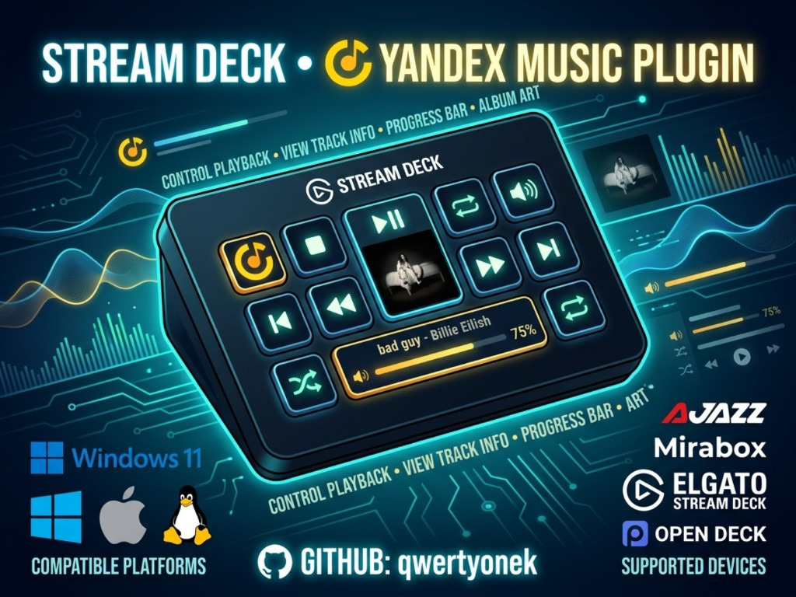

<p align="center">
  
</p>

<h1 align="center">Yandex Music — Stream Deck / OpenDeck</h1>

<p align="center">
  <strong>Управляй Яндекс Музыкой прямо с деки</strong><br>
  Play · Обложка · Бегущая строка · Запуск приложения одной кнопкой
</p>

<p align="center">
  <a href="https://github.com/qwertyonek/yamusic-streamdeck-plugin/releases"></a>
  <a href="https://github.com/qwertyonek/yamusic-streamdeck-plugin/stargazers"></a>
  <a href="https://github.com/nekename/OpenDeck"></a>
  <a href="https://github.com/qwertyonek/yamusic-streamdeck-plugin/blob/main/README.md"></a>
  <a href="https://github.com/qwertyonek/yamusic-streamdeck-plugin/blob/main/README.md"></a>
  <a href="https://github.com/qwertyonek/yamusic-streamdeck-plugin/blob/main/README.md"></a>
</p>

<p align="center">
  Форк <a href="https://github.com/whxtelxs/Yandex-Music-Ajazz-Plugin">Yandex Music Ajazz Plugin</a> (whxtelxs) ·
  идея CDP — <a href="https://github.com/Judd1zzz/yandex-music-streamdeck">Judd1zzz/yandex-music-streamdeck</a>
</p>

---

## Возможности

### Кнопки

| Action | Что делает |
|--------|------------|
| **Плей / Пауза** | Воспроизведение и пауза, иконка меняется по состоянию |
| **Следующий / Предыдущий** | Переключение треков |
| **Лайк / Дизлайк** | Оценка трека, состояние на кнопке |
| **Выключить звук** | Mute / unmute |
| **Обложка трека** | Живая обложка + **запуск / перезапуск Яндекс Музыки** с debug-портом |
| **Название трека** | Бегущая строка «Артист — Название» |
| **Время трека** | Текущее / общее время |

### Кнопка «Обложка» — не только картинка

Это **лаунчер приложения**:

- Яндекс Музыка **не запущена** → плагин стартует её с `--remote-debugging-port=9222`
- Запущена **без** debug-порта → перезапуск с правильными параметрами
- Уже всё ок → обновляет обложку и CDP-соединение

Работает на **Linux, Windows и macOS**.

---

## Совместимость

### Платформы

| Платформа | Хост | Статус |
|-----------|------|--------|
| **Linux** | [OpenDeck](https://github.com/nekename/OpenDeck) | ✅ основной кейс форка |
| **Windows** | OpenDeck, StreamDock, Elgato* | ✅ |
| **macOS** | OpenDeck, StreamDock | ✅ |

\* Elgato Stream Deck — через совместимый SDK, полный тест не гарантируется.

### Устройства

Ajazz AKP153 · Mirabox N4 · Elgato Stream Deck · другие keypad-устройства с Stream Deck SDK / OpenDeck.

### Яндекс Музыка

Десктоп-клиент (Electron) с флагом:

```text
--remote-debugging-port=9222
```

Без него плагин не подключится к приложению.

---

## Установка

### 1. Скачай плагин

[**Releases → `ru.yandex.music.sdPlugin.zip`**](https://github.com/qwertyonek/yamusic-streamdeck-plugin/releases/latest)

> Release уже содержит `node_modules` — **`npm install` не нужен**.

<details>
<summary><strong>Windows — OpenDeck / StreamDock</strong></summary>

Распакуй `ru.yandex.music.sdPlugin` в:

```text
%APPDATA%\opendeck\plugins\
```

или для StreamDock / Ajazz:

```text
%APPDATA%\HotSpot\StreamDock\plugins\
```

Перезапусти OpenDeck / StreamDock.

</details>

<details>
<summary><strong>Linux — OpenDeck</strong></summary>

```bash
# из Release
unzip ru.yandex.music.sdPlugin.zip -d ~/.config/opendeck/plugins/

# или reload, если уже стоит
opendeck --reload-plugin ru.yandex.music.sdPlugin
```

</details>

<details>
<summary><strong>macOS — OpenDeck / StreamDock</strong></summary>

```text
~/Library/Application Support/opendeck/plugins/
```

или StreamDock:

```text
~/Library/Application Support/HotSpot/StreamDock/plugins/
```

</details>

<details>
<summary><strong>Клон из git (для разработки)</strong></summary>

```bash
git clone https://github.com/qwertyonek/yamusic-streamdeck-plugin.git
cd yamusic-streamdeck-plugin/plugin && npm install
```

</details>

---

## Запуск Яндекс Музыки

Плагин управляет клиентом через **Chrome DevTools Protocol**. Нужен процесс с debug-портом (по умолчанию **9222**, меняется в Property Inspector).

### Способ 1 — кнопка «Обложка» (рекомендуется)

Нажми action **«Обложка трека»** на деке — плагин сам запустит или перезапустит Яндекс Музыку.

### Способ 2 — debug-ярлык (Linux)

При первом запуске плагина создаётся файл:

```text
~/.local/share/applications/yandexmusic-debug.desktop
```

В меню приложений появится **Yandex Music (Debug)**. При смене порта в Property Inspector ярлык обновляется автоматически.

### Способ 3 — ярлык / команда вручную

<details>
<summary><strong>Linux</strong></summary>

```bash
/opt/yandex-music/yandexmusic --remote-debugging-port=9222 --gtk-version=3
```

Путь к бинарю зависит от способа установки (AUR, .deb, `/opt/…`).

</details>

<details>
<summary><strong>Windows</strong></summary>

Создай ярлык и в поле «Объект» добавь в конец:

```text
--remote-debugging-port=9222
```

Пример:

```text
"C:\Users\ИМЯ\AppData\Local\Programs\YandexMusic\Яндекс Музыка.exe" --remote-debugging-port=9222
```

Запускай музыку **только через этот ярлык**, иначе CDP не подключится.

</details>

<details>
<summary><strong>macOS</strong></summary>

```bash
open -a "Яндекс Музыка" --args --remote-debugging-port=9222
```

</details>

### Проверка соединения

1. Повесь любую кнопку плагина на деку  
2. Открой Property Inspector  
3. Нажми **«Проверить соединение»** → статус **«Подключено»**

---

## Настройки

В Property Inspector любой кнопки:

| Параметр | Описание |
|----------|----------|
| **Порт отладки** | По умолчанию `9222`. Должен совпадать с флагом запуска Яндекс Музыки |
| **Проверить соединение** | Тест CDP-подключения к клиенту |

---

## OpenDeck: иконки

В `manifest.json` пути к картинкам **без расширения** (`imgs/ym-play`). OpenDeck дописывает `.png`.

Файлы лежат в `imgs/*.png` (300×300). На StreamDock пути могут отличаться — при проблемах с иконками перевесь кнопки заново.

---

## Отличия от upstream

| | [whxtelxs v1.5](https://github.com/whxtelxs/Yandex-Music-Ajazz-Plugin) | Этот форк |
|---|----------|-----------|
| OpenDeck + Linux | ❌ | ✅ |
| Авто debug-ярлык (Linux) | ❌ | ✅ |
| Запуск YM с кнопки обложки | play/pause | **лаунcher + debug-порт** |
| Shuffle / repeat / volume / энкодеры | ✅ | пока нет |
| UUID actions | `com.whxtelxs…` | `ru.yandex.music.*` |

---

## Проблемы?

| Симптом | Решение |
|---------|---------|
| Кнопки не реагируют | Яндекс Музыка запущена **с** `--remote-debugging-port=9222`? |
| Восклицательный знак на иконке | OpenDeck: перевесь action или reload плагина; проверь `imgs/*.png` |
| «Не подключено» в PI | Закрой YM без debug-порта → запусти через обложку / debug-ярлык |
| Обложка не обновляется | Проверь CDP; нажми обложку для переподключения |
| Порт занят | Смени порт в PI и в ярлыке / команде запуска |

---

## Разработка

```bash
cd plugin
npm install
node test-connection.js
```

Логи: `log/` и `plugin/log/`.

---

## Авторы

| | |
|---|---|
| **Maintainer** | [qwertyonek](https://t.me/qwertyonek) · [GitHub](https://github.com/qwertyonek) |
| **Original plugin** | [whxtelxs](https://whxtelxs.dev) · [Yandex-Music-Ajazz-Plugin](https://github.com/whxtelxs/Yandex-Music-Ajazz-Plugin) |
| **CDP reference** | [Judd1zzz/yandex-music-streamdeck](https://github.com/Judd1zzz/yandex-music-streamdeck) |

---

<p align="center">
  
  <br><br>
  <sub>Не аффилирован с Яндексом. Используй на свой страх и риск.</sub>
</p>
